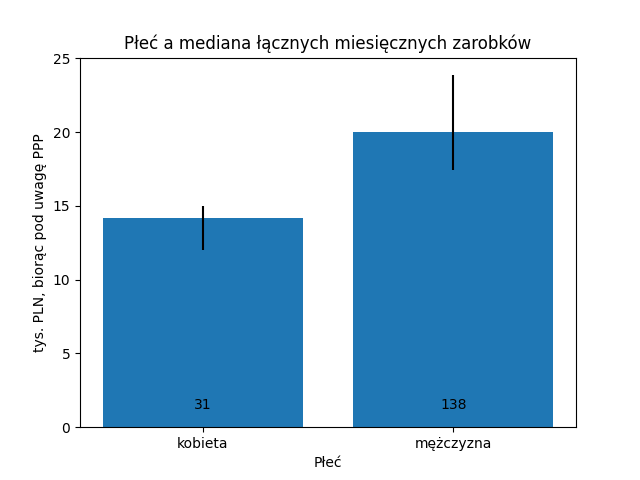

---
title: "Analiza losów MIMowych absolwentów"
author: Jakub Sygnowski
date: 22 lipca 2021
---

## Wstęp
Jestem absolwentem informatyki na MIMie z roku 2016. Poniżej przedstawiam wyniki ankiety przeprowadzonej 17.07.-21.07.2021 dotyczącej losów absolwentów wydziału MIM.

### O ELA
Podsumowanie danych o podobnej tematyce do tych zebranych w ankiecie pochodzące z systemów ZUS można obejrzeć w systemie [Ekonomicznych Losów Absolwentów](ela.nauka.gov.pl).

Główną motywacją do zrobienia osobnej ankiety, poza możliwością zebrania bardziej szczegółowych danych (zawód, liczba pracowników firmy, i inne) było objęcie analizą również osoby mieszkające za granicą, nieuwzględnione w systemie ZUS.

Zakładając faktyczne bezrobocie na poziomie kilku procent, zgodnie z danymi z ELA, ok. połowa spośród mojego rocznika informatyki jest nieuwzględniona w tym systemie w przeciętnym miesiącu.[^1]

[^1]: 86.5% w ogóle figuruje w systemie ZUS, i spośród nich 60.2% jest uznana jako pracująca w przeciętnym miesiącu. ([link](https://ela.nauka.gov.pl/reports/v6.0/graduates/pl/2016/3828/6749/SECOND/pl_2016_3828_6749_UNEMPLOYMENT_SECOND_FULL.pdf?lang=pl))

### O ankietach w internecie
Ankieta była anonimowa, przerowadzona przez facebooka i grupę alumni; każdy mógł wpisać dowolne dane.[^2] Zebrane dane należy więc traktować jako mniej wiarygodne niż te z ELA, ale mają one szansę pokryć społeczność absolwentów bardziej rownomiernie.

[^2]: W szczególności płeć: helikopter bojowy.

### Metodologia
W ankiecie prosiłem o odniesienie do roku 2019, aby uniknąć statystycznych zmian związanych z pandemią.

W celu zagregowania dochodów w różnych krajach używałem kursu walut opartego o [parytet siły nabywczej (PPP)](https://en.wikipedia.org/wiki/Purchasing_power_parity): hipotetyczny kurs wymiany uwzględniający różnicę w cenach dóbr w różnych krajach.

Użycie tego wskaźnika pozwala odpowiedzieć na pytanie "jakiej pensji w Polsce dana osoba potrzebowałaby, aby pozwolić sobie na takie same wydatki na jakie może pozwolić sobie w swoim kraju"[^3], ale nie bierze pod uwagę na ile wyższe zarobki za granicą wynikają z przeciętnie wyższych pensji tam.[^4]

[^3]: Ten wskaźnik jest oparty o jakiś standardowy koszyk dóbr.
[^4]: Rozważałem przedstawienie danych jako wielokrotność przeciętnej pensji w danym kraju, ale a) nie jest to popularną statystyką b) tego typu dane są zwykle podawane netto, i w przeliczeniu na członka rodziny, a dane, które zebrałem brutto i na osobę.

Spośród danych o zarobkach zdarzały się wpisy na poziomie znacznie poniżej pensji minimalnej. Podejrzewam, że są one związane z:

  - podaniem pensji miesięcznie, a nie rocznie
  - podaniem pensji w tysiącach, a nie nominalnie

Postanowiłem pominąć te dane w analizie (stanowią one $18/189 \approx 9.5\%$ wszystkich próbek które podały pensje). Pominąłem również 1 próbkę osoby "bezrobotnej, nieszukającej pracy".

Przy podawaniu statystyk dla grup, pominąłem grupy o mniej niż 5-ciu członkach.

## Wyniki

### Zależność cech od kierunku

{width=80% height=80%}

{width=80% height=80%}

{width=80% height=80%}

### Zależność zarobków od cech

Słupki błędu odpowiadają centylom: 40-60 wokół mediany.

{width=80% height=80%}

{width=80% height=80%}

{width=80% height=80%}

{width=80% height=80%}

{width=80% height=80%}

{width=80% height=80%}

{width=80% height=80%}

### Rozkład pojedynczych cech

{width=80% height=80%}

{width=80% height=80%}

{width=80% height=80%}

{width=80% height=80%}

{width=80% height=80%}

Kod użyty do przygotowania powyższej analizy można znaleźć pod adresem: [https://github.com/sygi/alma/](https://github.com/sygi/alma/)

Podsumowanie wygenerowane przez Google Forms (zawierające podsumowanie każdego pytania osobno): [tutaj](https://docs.google.com/forms/d/1cxSKJUPg-Us36rHtWib-qs1jylEFRg58k5yJGfCgygM/viewanalytics).

Zachęcam do tworzenia dalszych analiz w oparciu o zebrane dane. Są one dostępne do pobrania [tutaj](https://docs.google.com/spreadsheets/d/1ygu47Da7NORUdF8oVtsHsbn1zzYzapkv85dD5X8nOcY/edit?usp=sharing).

Dziękuję wszystkim 203 absolwentom, którzy poświęcili swój czas wypełniając ankietę oraz Michalinie Pacholskiej, Jackowi Migdałowi, i Henrykowi Michalewskiemu za przejrzenie ankiety przed wysłaniem.
